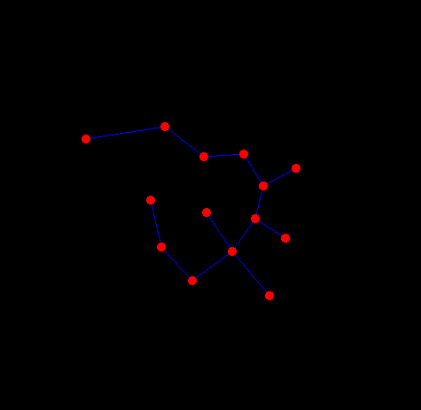

# Dynamically drawing minimum spanning tree

Dynamically building and drawing minimum spanning tree using Kruskal's algorithm

## Example

## Links

[Minimum spanning tree](https://en.wikipedia.org/wiki/Minimum_spanning_tree)\
[Kruskal's algorithm](https://en.wikipedia.org/wiki/Kruskal's_algorithm)\
[Union–find data structure](https://en.wikipedia.org/wiki/Disjoint-set_data_structure)
